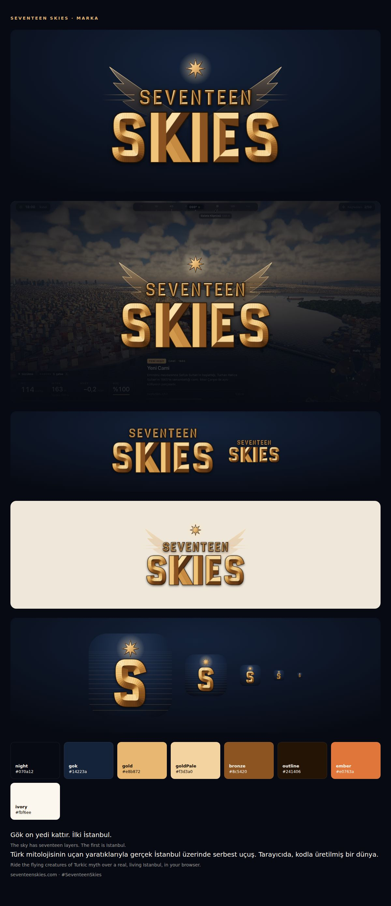

# Seventeen Skies — brand



## Name

**Seventeen Skies**, always written out in words and in title case. Domain: **seventeenskies.com**, shown as
`SeventeenSkies.com` wherever people read it (posters, trailer end cards, social bios) so the two words stay apart.
Hashtag: `#SeventeenSkies`, never `#Seventeen` alone (it collides with the K-pop group SEVENTEEN).

- Do not shorten it to "17 Skies" or put digits in the name, domain or handles; digits read as a cheap mobile game.
- In Turkish text the name stays in English. Mark it `lang="en"` in HTML so CSS uppercasing does not turn the `i`
  of Skies into a Turkish `İ`.
- `evren` remains the internal codename in code identifiers (`window.__evren`, `EVREN_*`, Blender / Unreal assets).
  The dragon you fly today is named Evren.

### The story (for store pages, press and trailers)

In old Turkic belief the sky (*gök*) has seventeen layers. Each layer is home to its own spirits, and Ülgen sits on a
golden throne at the top. Only a *kam* (shaman) could reach him, riding the spirit of a mount up through the layers
one by one. Seventeen Skies is that ride: you fly the mythic creatures of Turkic legend (the dragon Evren today;
Tulpar, Zümrüdüanka, Hüma and others later) over a real, living city. Istanbul is the first sky.

## Lines

| Use | Turkish (in game) | English |
|---|---|---|
| Brand line | Gök on yedi kattır. İlki İstanbul. | The sky has seventeen layers. The first is Istanbul. |
| Description | Türk mitolojisinin uçan yaratıklarıyla gerçek İstanbul üzerinde serbest uçuş. Tarayıcıda, kodla üretilmiş bir dünya. | Ride the flying creatures of Turkic myth over a real, living Istanbul, in your browser. |

The constants live in `src/ui/brand.ts` (`BRAND`); UI code reads them from there.

## Logo

The logo is drawn in code (`src/ui/brand-logo.ts`), so it needs no font and stays sharp at every size.

- **Title logo** (`titleLogoSvg()`): SEVENTEEN set small over a large SKIES in carved, faceted capitals (a nod to
  the chiselled Orkhon inscriptions), metallic gold lit from the upper left, with a dark bronze outline. Every
  stroke is split along its centre line into two facets, each shaded by how it faces the light.
- **Crest** (on by default): the rising wings behind the title, the eight-pointed star of the upper sky above it,
  and the layered rules either side of SEVENTEEN. Use the crest for the loading screen, share images, store art
  and anything above ~300 px wide. Below that use `crest: false` (the pause menu uses it at 132 px).
- **Monogram** (`monogramSvg()`): a carved S under the star, over seventeen faint layers on a night-blue tile. App
  icons, favicons, avatars.

Rules:

- Place the logo on dark or mid-dark backgrounds (night sky, dusk, darkened game shots). On light backgrounds it
  works but loses the glow; do not put it on busy bright areas without a scrim.
- Do not recolour, stretch, outline, re-letter or add effects to it. Do not set the name in another font next to
  the logo; the brand line is set in the UI font (`--font-display`).
- Keep clear space of at least the height of SEVENTEEN around the title logo.

## Colours

| Token | Hex | Use |
|---|---|---|
| night | `#070a12` | Backgrounds, theme colour |
| gok | `#14223a` | Secondary backgrounds, gradients |
| gold | `#e8b872` | Logo mid tone, UI accent (`--accent`) |
| goldPale | `#f3d3a0` | Highlights, brand line (`--accent-2`) |
| bronze | `#8c5420` | Logo shadow tone |
| outline | `#241406` | Outline behind the carved letters |
| ember | `#e0763a` | Sparing warm accent |
| ivory | `#fbf6ee` | Text on dark |

## Files

`public/brand/` (served at `/brand/`, linked from `index.html`):

| File | What |
|---|---|
| `logo.svg` | Title logo with crest, transparent |
| `logo-title.svg` | Title logo without crest (small sizes) |
| `icon.svg`, `favicon.svg` | Monogram tile |
| `favicon-32.png`, `icon-192.png`, `icon-512.png` | Monogram PNGs (transparent corners) |
| `apple-touch-icon.png` | 180 px monogram, square (iOS rounds the corners) |
| `og.jpg` | 1200 × 630 share image (Open Graph / Twitter card) |
| `site.webmanifest` | Web app manifest |

Regenerate after changing the logo code:

```bash
npm run brand            # writes the SVGs and the manifest, prints the snap commands for the PNGs
```

The PNGs are screenshots of `sandbox/brand.html` (`?show=og`, `?show=icon&size=…`); the page without parameters is
the brand sheet above. The share image uses the Bosphorus shot from `.docs/media/bosphorus-bridge.jpg`, cropped so
the HUD stays out of frame; replace it with a HUD-less capture (`?nohud=1`) when one is taken.

## Domain setup (to do)

The game is still deployed to GitHub Pages under the repository path (`/evren/`). To serve it from
seventeenskies.com: point the domain's DNS at GitHub Pages, set the custom domain in the repository's Pages
settings, and build with `--base=/` in `.github/workflows/deploy.yml`. The Open Graph tags in `index.html` already
use `https://seventeenskies.com/`.
