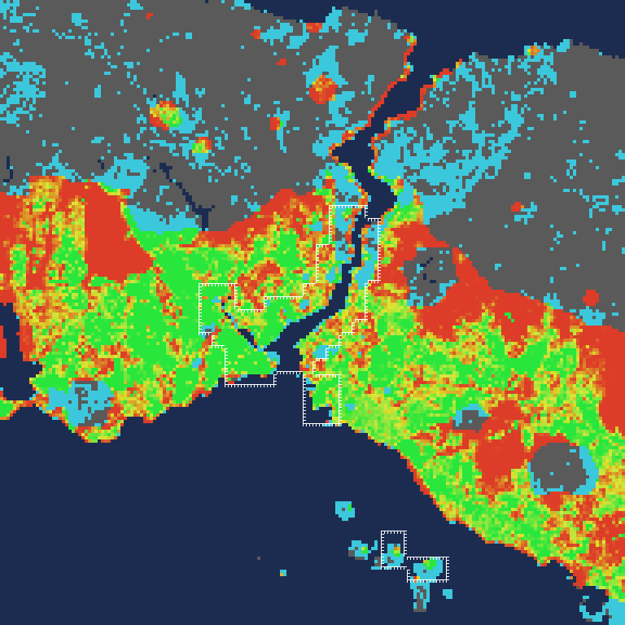

# OSM coverage of the playable square (phase 24, S0)

Audit for [phase 24](../planning/24-far-osm-layer.md). Produced by `npx tsx scripts/data/osm-city-audit.ts` from the
local extract (OpenStreetMap France mirror of the Turkey extract, osmBase 2026-09-25T01:52:55Z, md5 verified). Raw
numbers: [osm-city-coverage.json](osm-city-coverage.json).

Legend:
- Blue: geo water.
- Grey: land the geo map does not build on, and no OSM buildings.
- Red → yellow → green: OSM footprint coverage of the geo-buildable land (0 → 0.15 → ≥ 0.3).
- Cyan: OSM buildings where the geo map builds nothing.
- White outline: the flight-scale regions.

## Buildings

- **616,472 OSM outlines** in the ±24 km square, plus 1,392 building:part records.
- **140 km²** of footprint in total.
- Only **10.6 %** carry `height` or `building:levels`. Heights mostly come from `fillLevels` (neighbour median) and the
  district profile, exactly as in the region layer.
- **5.0 vertices** per outline after the fetch's simplification (0.35 m).

## Coverage

Coverage is OSM footprint area divided by the geo-buildable area, per 250 m cell. It is compared only in "built
cells", where at least 30 % of the cell is geo-buildable; there are 12,277 such cells.

| | p10 | p25 | p50 | p75 | p90 |
|---|---|---|---|---|---|
| inside the regions (known good) | 0.037 | 0.102 | 0.215 | 0.375 | 0.49 |
| whole square | 0 | 0.014 | 0.142 | 0.278 | 0.406 |

Even well-mapped regions have a tenth of their cells below 0.04: parks, squares and big plots. A per-cell mask would
therefore be patchy. Averaged over the 3 × 3 cells around each cell (750 m):

| smoothed threshold | built cells covered | region cells covered | OSM buildings in covered cells |
|---|---|---|---|
| 0.05 | 77.1 % | 97.2 % | 546,209 |
| 0.08 | 70.4 % | 93.1 % | 539,522 |
| 0.10 | 65.7 % | 88.3 % | 531,818 |
| 0.15 | 53.5 % | 76.0 % | 500,813 |

**Chosen for S1: smoothed coverage ≥ 0.05.** It keeps 97 % of the known-good region cells. S1 adds hysteresis, so the
mask outline does not fray.

## Built cells without OSM buildings: mostly a geo land-use error

4,037 built cells have coverage < 0.05, a total of 236 km² of geo-buildable land. The OSM land-use polygons there
are:

| class | km² |
|---|---|
| forest / wood / scrub | 76.5 |
| grass / meadow | 24.2 |
| industrial / port / construction | 13.4 |
| park / garden | 10.3 |
| farm | 7.1 |
| cemetery | 4.4 |
| residential / commercial | **18.0** |
| (no OSM land use) | about 80 |

Most of the red on the map is not an OSM gap. It is the hand-drawn, domain-warped geo land use calling forests,
meadows and parks "urban", and the procedural city builds an invented town on them today. Only about 18 km² is
mapped residential land without mapped buildings: a real OSM gap, where the procedural fallback belongs.

Consequence for the plan: stamping OSM land use into the geo build (the old S4) has to land with the data-mode city
(S2). Otherwise the procedural fallback keeps building on those forests.

The cyan cells are the reverse case: about 70k OSM buildings stand on land the geo map leaves empty, mostly villages
in the north and settlements the zones miss. In the bake, every cell that is not geo-buildable draws whatever OSM
buildings it has; the procedural city places nothing there anyway.

## Land use

OSM polygons in the square, by class (count, km²):

| class | polygons | km² |
|---|---|---|
| park | 5,985 | 33.2 |
| grass | 9,656 | 54.8 |
| forest | 3,121 | 629.8 |
| cemetery | 309 | 9.0 |
| farm | 407 | 23.0 |
| water | 955 | 29.1 |
| industrial | 3,024 | 84.4 |
| residential | 6,852 | 290.3 |
| pitch | 3,881 | 8.3 |

## Bake size

Estimated from these counts. Every building is 12 B of attributes plus 4 B per Int16 vertex; land-use polygons are
simplified to 2 m.

- **L0: 19.7 MB raw, about 11 MB gzip.**
- The L0 + L1 + L2 pyramid: about 26 MB raw, about 14 MB gzip.
- Land use: 1.8 MB raw.

All of it is well inside what the repository already carries (the regions are 21 MB of JSON). Committing the bake
(decision 2) is fine.

## Notes

- `download.geofabrik.de` was unreachable from the cloud session: the tunnel closed mid-exchange. The same extract
  came from `download.openstreetmap.fr/extracts/europe/turkey-latest.osm.pbf` (md5 checked against its `.md5`).
- The index header still says "Geofabrik extract" because `osm-local.mjs` hard-codes the label. S1 records the real
  source in the bake.
- The whole audit takes about 75 s: 576 local queries of 2 km blocks.
