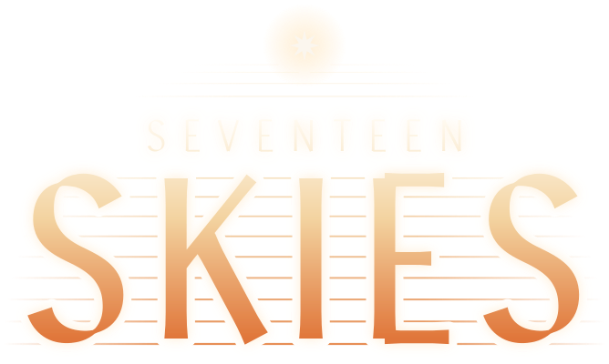
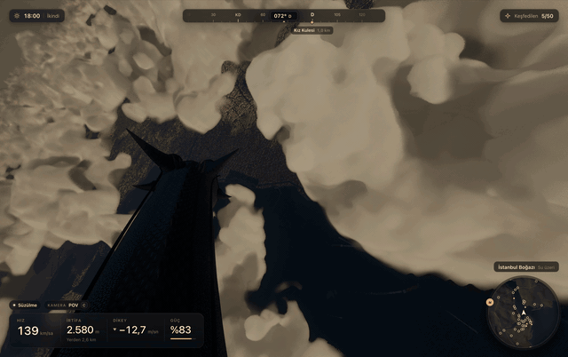
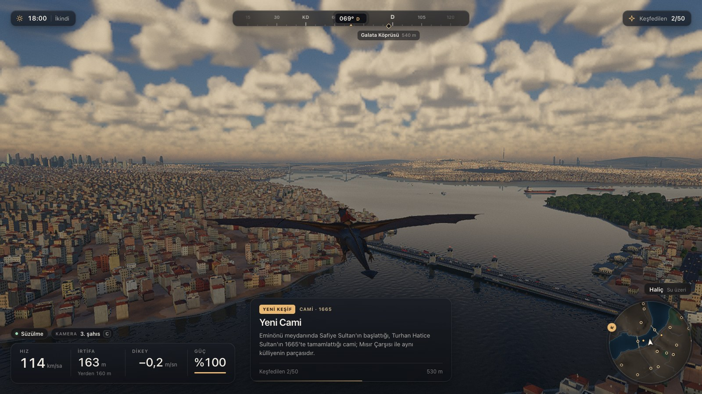
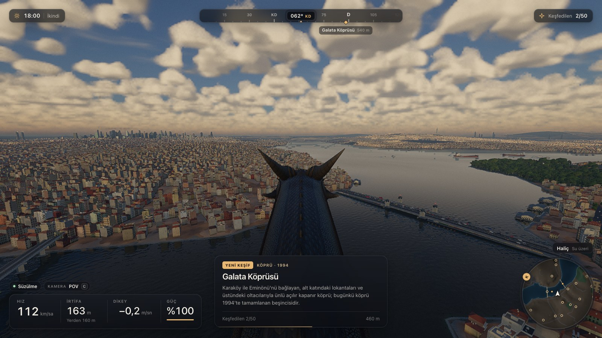
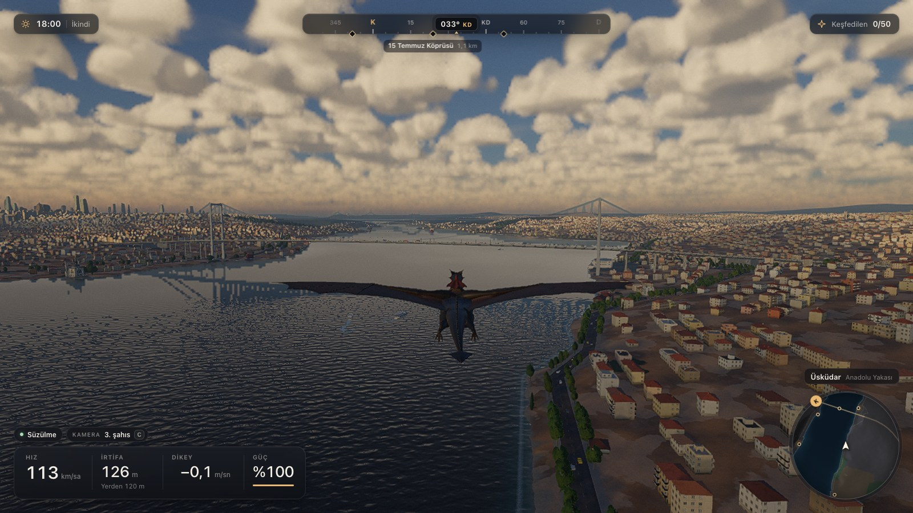
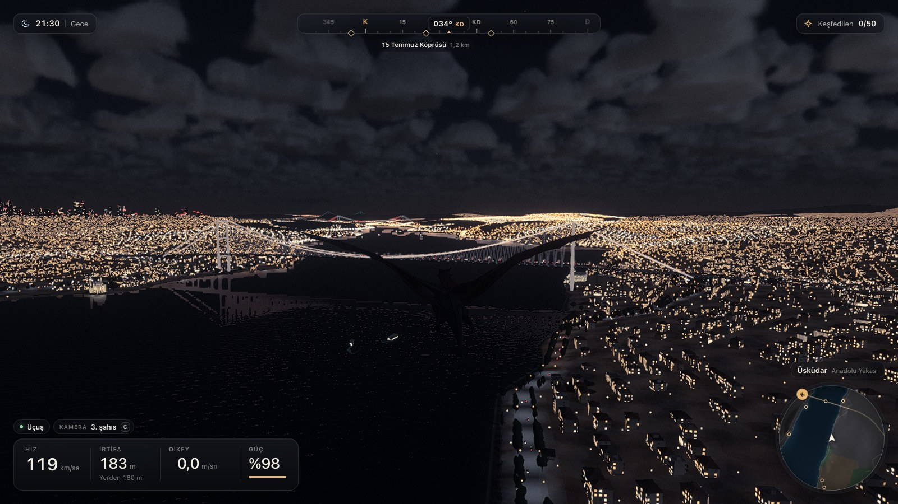
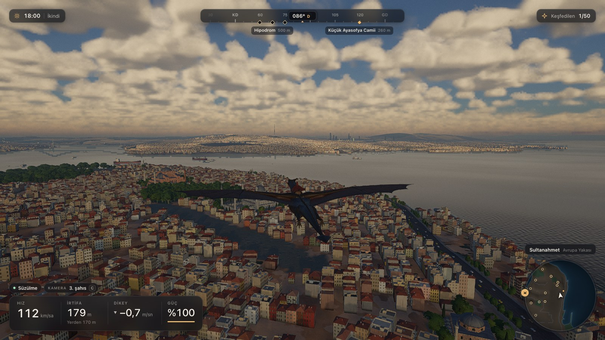
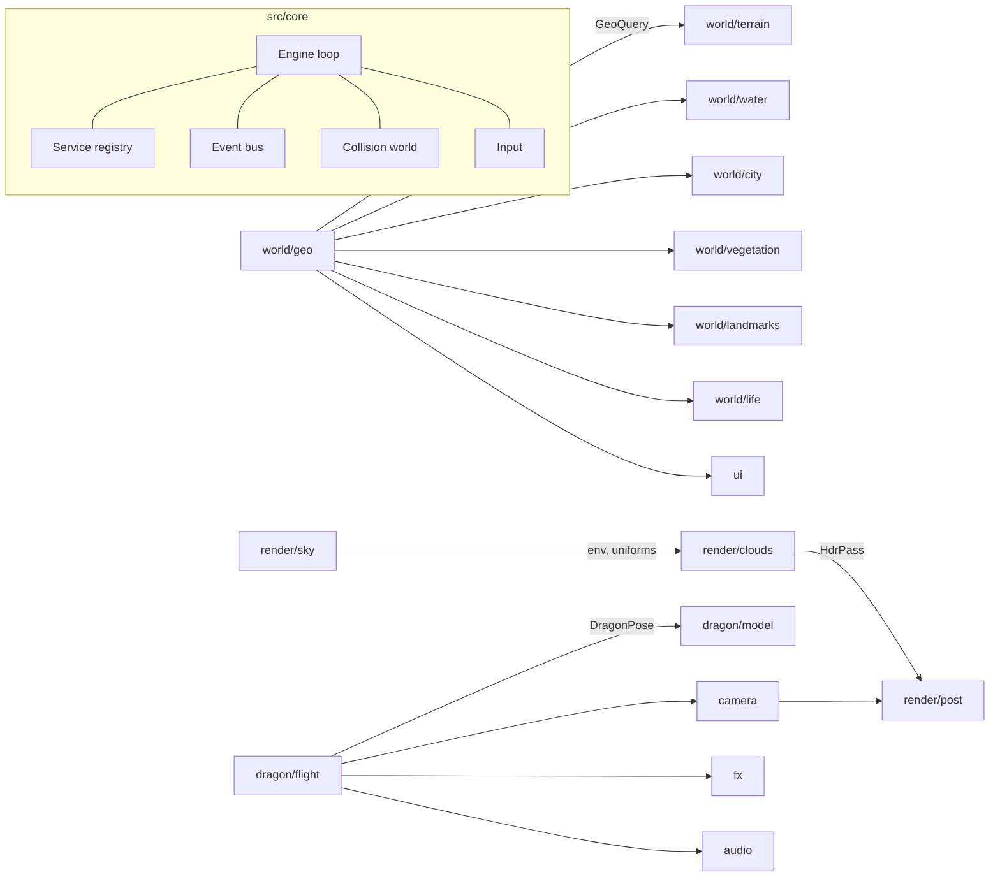

<div align="center">



**The sky has seventeen layers. The first is Istanbul.**
A realistic, open-world flight game in the browser: ride the flying creatures of Turkic myth over a real, living
Istanbul. Every building, cloud, wave, sound and even the dragon itself is generated in code at runtime.

[**▶ Play the live demo**](https://davutkmbr.github.io/evren/) ·
[seventeenskies.com](https://seventeenskies.com) ·
[Roadmap](.docs/planning/README.md) ·
[Architecture](#architecture) ·
[Run locally](#getting-started)




<sub>First-person view from the saddle: diving through cumulus at 2.3 km toward the Bosphorus.</sub>

</div>

## What is this?

You sit in the saddle of an 18-metre dragon and fly freely over a 48 × 48 km recreation of Istanbul: the historic
peninsula, the Golden Horn, both shores of the Bosphorus, the Princes' Islands and the Black Sea entrance. The
coastline, hills and landmark positions follow the real city; the sun and moon move along their real paths for
Istanbul's latitude, so the light at 18:00 in late September looks like it does there.

**Why "Seventeen Skies"?** In old Turkic belief the sky (*gök*) has seventeen layers, each home to its own spirits,
with Ülgen on his golden throne at the top. A *kam* (shaman) rode the spirit of a mount up through them, layer by
layer. That is the game: you ride a mythic flyer into the sky, and Istanbul is the first layer. The dragon you fly
today is named **Evren** (in Turkic myth the great dragon; in modern Turkish, "the universe"); more flying creatures
of Turkic myth will join it. The brand, logo and their rules are in [.docs/brand](.docs/brand/README.md).

It is meant to be a calm experience: no fail state, forgiving flight assistance, and a city that keeps revealing
landmarks, ferries, gulls and night lights as you explore.

<table>
  <tr>
    <td></td>
    <td></td>
  </tr>
  <tr>
    <td align="center"><sub>Golden Horn and Galata Bridge, with a discovery card for Yeni Cami</sub></td>
    <td align="center"><sub>First-person view over the dragon's horns</sub></td>
  </tr>
  <tr>
    <td></td>
    <td></td>
  </tr>
  <tr>
    <td align="center"><sub>Up the Bosphorus toward the 15 Temmuz and FSM bridges</sub></td>
    <td align="center"><sub>Night over Üsküdar, planar reflections on the strait</sub></td>
  </tr>
  <tr>
    <td colspan="2"></td>
  </tr>
  <tr>
    <td colspan="2" align="center"><sub>The historic peninsula: Hagia Sophia, Topkapı's gardens and the Marmara shore</sub></td>
  </tr>
</table>

## Features

**The city**
- Real geography: hand-encoded coastlines, the Bosphorus S-curves, the Golden Horn, islands, river valleys and
  relief checked against ~1,900 SRTM spot heights.
- Procedural Istanbul fabric streamed around you: cream and pastel apartment blocks with terracotta roofs, wooden
  houses with bay windows (cumba), waterfront mansions (yalı), Levent and Ataşehir towers; lit windows at night.
- 50 landmarks at their real positions, built from parametric generators: Ottoman imperial mosques (Sultanahmet,
  Süleymaniye, Yeni Cami…), Hagia Sophia, the three Bosphorus bridges, Galata and Maiden's towers, Topkapı and
  Dolmabahçe palaces, Rumeli Hisarı, the Theodosian land walls and more, plus neighbourhood mosques and minarets
  across the city.
- Trees by species (stone pine, cypress, plane tree), ferries and tankers on real routes, gull flocks, car light streams.

**Sky and water**
- Physically based atmosphere (transmittance and sky-view LUTs), real sun and moon positions, stars, aerial perspective.
- Raymarched volumetric clouds with temporal reprojection; you can fly through and above them; cloud shadows on the ground.
- Gerstner-wave water with planar reflections, depth-based colour, shoreline foam and the Bosphorus surface current.
- Weather you can switch on and off: drifting ground fog banks, rain streaks with an overcast sky and rain sound,
  thunderstorms with branching lightning, sky flashes and thunder delayed by distance; plus an aerial softening of the
  far city (Settings → Hava, or `N` to cycle).

**The dragon**
- A procedurally modelled, skinned dragon and rider (71 bones) with scale textures and back-lit wing membranes.
- 6-DOF flight physics: lift and stall, flapping thrust, gliding, diving at ~85 m/s, hovering, landing, walking and swimming.
- Fire breath with dynamic light, roars, splashes, wing-tip vortex trails.
- Tricks and a real sense of falling: barrel rolls and continuous spins, loops, free fall with folded wings and a
  wing-snap catch into a swoop, the "dehh" speed surge, leap take-offs; a short caption names each maneuver.
- The rider shows every command (reins, crouch, rein snaps and heel kicks, pointing, cheering), also in first person;
  they can pet the dragon, stand on the saddle, and the dragon turns its head back to look at them.
- Third-person chase, first-person (POV) from the saddle, and an automatic cinematic camera.

**Everything else**
- Audio: recorded CC0 wind, wingbeats, thunder, rain and gulls (Freesound, `public/audio/`) with WebAudio synthesis for
  roars, fire, sea and city ambience (and as the fallback for the flight and weather recordings).
- Turkish UI: HUD, compass with landmark bearings, minimap, full map with teleport, discovery cards, photo mode, settings.
- Four quality presets, dynamic resolution and auto exposure; 60 fps on an Apple M2 Max at 1600×900 ("high").

## Controls

| Key | Action |
|---|---|
| `W` / `S` | Nose down / up |
| `A` / `D` | Bank left / right |
| `Q` / `E` | Rudder left / right |
| `Space` | Flap (climb, speed up); leap take-off from the ground |
| `V` | "Dehh!": the rider snaps the reins, three strong beats and a speed surge |
| `Shift` | Fold wings: dive, or free fall when slow (double tap: drop) |
| `Shift` release / `Space` | Snap the wings open and catch the fall |
| `A` / `D` double tap | Barrel roll (hold to keep spinning) |
| `S` double tap | Loop |
| `Ctrl` / `X` | Brake, hover |
| `F` / left click | Fire breath |
| `R` | Roar |
| `L` | Land / take off |
| `G` (hold) | Pet the dragon (it turns to look at you and purrs) |
| `T` | Stand up on the saddle / sit down |
| Mouse | Look around (hold right click, or always in POV) |
| `C` | Camera: third person / POV / cinematic |
| `[` / `]` | Change the time of day |
| `N` | Weather: clear, haze, fog, rain, storm |
| `M` | Map (click to teleport) |
| `O` | Photo mode |
| `U` | Hide the HUD |
| `H` | Help |
| `Esc` / `P` | Pause and settings |

Gamepads are supported (left stick to steer, A to flap, X to breathe fire, Y to switch camera).

## Getting started

Requirements: Node.js 22.12 or newer and a browser with WebGL 2 and the `EXT_clip_control` extension (a recent
Chrome or Edge is recommended).

```bash
git clone https://github.com/davutkmbr/evren.git
cd evren
npm install
npm run dev
```

Then open <http://127.0.0.1:5199/>.

| Command | Description |
|---|---|
| `npm run dev` | Development server with hot reload |
| `npm run build` | Type-check and build to `dist/` |
| `npm run preview` | Serve the production build |
| `npm run snap -- --url "/?view=galata"` | Render a GPU screenshot and print engine stats (see [Tooling](#tooling)) |

### URL parameters

| Parameter | Example | Effect |
|---|---|---|
| `view` | `?view=galata` | Start at a named viewpoint: `spawn`, `sultanahmet`, `ayasofya`, `galata`, `halic`, `bogaz`, `koprusu`, `fsm`, `rumelihisari`, `kizkulesi`, `uskudar`, `levent`, `camlica`, `adalar`, `karadeniz`, `yuksek`, `gece` |
| `t` | `?t=21.5` | Time of day in hours |
| `cam` | `?cam=pov` | Camera mode: `third`, `pov`, `cinematic` |
| `q` | `?q=ultra` | Quality preset: `low`, `medium`, `high`, `ultra` |
| `autopilot` | `?autopilot=1` | Gentle hands-off flight |
| `weather` | `?weather=storm` | Weather preset: `clear`, `haze`, `fog`, `rain`, `storm` |
| `fog`, `rain`, `storm` | `?fog=0.6&rain=0.3` | Individual weather amounts 0..1 (override the preset) |
| `farblur` | `?farblur=0` | Distance softening of far buildings 0..1 (default 0.6, 0 = off) |
| `autostart` | `?autostart=1` | Skip the start screen |
| `stats` | `?stats=1` | Performance overlay |
| `nohud` | `?nohud=1` | Hide the HUD |

## Architecture

The engine is a small core plus 18 independent modules. Modules never import each other; they talk only through
typed contracts, a service registry, an event bus, shared uniforms and shared GLSL.



| Module | Responsibility |
|---|---|
| `core` | Engine loop, contracts, services, events, input, quality presets, collision world, shared uniforms |
| `world/geo` | Istanbul coastlines, relief, land use, districts, roads, landmark catalogue (built in workers) |
| `world/terrain` | CDLOD quadtree terrain with geomorphing, land-use shading, city carpet, roads, night lights |
| `world/water` | Sea, strait and Golden Horn surface, waves, planar reflections |
| `world/city` | Streamed procedural buildings, facades, roofs, colliders |
| `world/vegetation` | Tree species, placement, impostors, wind |
| `world/landmarks/*` | Mosques, bridges and towers, palaces and fortifications |
| `world/life` | Ships, ferries, gulls, road traffic |
| `render/sky` | Atmosphere, sun and moon, cascaded shadows, environment lighting |
| `render/clouds` | Volumetric clouds and cloud shadows |
| `render/post` | HDR pipeline, dynamic resolution, auto exposure, bloom, tone mapping, anti-aliasing |
| `dragon/model` | Procedural dragon and rider mesh, rig and procedural animation |
| `dragon/flight` | Flight physics, controls, landing and locomotion, animation driver |
| `camera` | Third-person, POV, cinematic and free cameras |
| `fx` | Particles: fire, splashes, trails, speed streaks |
| `audio` | Sound effects and ambience: WebAudio synthesis plus the recorded CC0 sounds in `public/audio/` |
| `ui` | Loading screen, HUD, map, discovery, menus |

Some technical choices worth knowing:

- **Reversed-Z float depth** (`EXT_clip_control`) so a 0.05 m near plane and a 60 km horizon coexist without z-fighting.
- **Linear HDR rendering** into a half-float target; tone mapping, bloom and exposure happen once in post.
- **One atmosphere for everything:** three.js fog chunks are replaced so every built-in material gets the same
  physically based aerial perspective as the custom shaders.
- **Heavy generation in Web Workers:** geography, city tiles, trees, landmarks and noise textures are built off the main thread.

## Tooling

- **Sandboxes:** every module has an isolated test page at `/sandbox/<module>.html` (for example
  `/sandbox/dragon.html?pose=glide`).
- **GPU screenshots:** `scripts/snap.mjs` drives headless Chrome on the real GPU, waits for streaming to settle and
  prints console errors plus engine stats (fps, draw calls, triangles, CPU time per system).

  ```bash
  node scripts/snap.mjs --url "/?view=koprusu&t=19" --out .shots/bridge.png --perf 3000
  ```

- **Flight tests:** `scripts/flight-test.mjs` flies scripted manoeuvres (cruise, glide, stall, dive, turns, landing)
  and prints the measured flight envelope.

## Roadmap

The project is at an early stage. The next phases are planned in [.docs/planning](.docs/planning/README.md):

| # | Phase | Status |
|---|---|---|
| 01 | [Review, bug fixing and performance](.docs/planning/01-review-and-performance.md) | Next |
| 02 | [Realistic relief and terrain shadows](.docs/planning/02-relief-and-terrain-shadows.md) | Planned |
| 03 | [Viewpoints: perch on bridges, towers and hills](.docs/planning/03-viewpoints.md) | Planned |
| 04 | [Landing and takeoff variety](.docs/planning/04-landing-takeoff-variety.md) | Planned |
| 05 | [Flight feel: free fall, g-force, thermals](.docs/planning/05-flight-feel.md) | Planned |
| 06 | [Bond with the dragon: gaze, petting, mood](.docs/planning/06-dragon-bond.md) | Planned |
| 07 | [Regional and adaptive music](.docs/planning/07-regional-music.md) | Planned |
| 08 | [Real city data from Overture / OpenStreetMap](.docs/planning/08-real-city-data.md) | Planned |
| 09 | [Materials, street detail and traffic](.docs/planning/09-materials-traffic-detail.md) | Planned |
| 10 | [Rider animation system](.docs/planning/10-rider-animations.md) | Planned |
| 11 | [Attack types](.docs/planning/11-attack-types.md) | Planned |
| 12 | [Dragon and rider variants](.docs/planning/12-dragon-rider-variants.md) | Planned |
| 13 | [Living world: weather, seasons, events, activities](.docs/planning/13-living-world.md) | Planned |
| 14 | [Multi-dragon foundation](.docs/planning/14-multi-dragon-foundation.md) | Planned |
| 15 | [Multiplayer](.docs/planning/15-multiplayer.md) | Planned |

Known issues are tracked in [phase 01](.docs/planning/01-review-and-performance.md).

## Contributing

Issues and pull requests are welcome. Please read [CLAUDE.md](CLAUDE.md) for the project conventions: code, commits,
pull requests and documentation are written in English, while everything the player sees stays in Turkish.
Before opening a pull request, run `npm run build` and check the affected views with `scripts/snap.mjs`.

## Credits and licence

- Code: [MIT](LICENSE) © 2026 Davut Kember.
- Geographic data in `src/world/geo/data` is derived from [OpenStreetMap](https://www.openstreetmap.org/copyright),
  © OpenStreetMap contributors, available under the [ODbL](https://opendatacommons.org/licenses/odbl/1-0/)
  (see [its licence note](src/world/geo/data/LICENSE.md)). Elevation checks use NASA SRTM data (public domain).
- Built with [three.js](https://threejs.org/).
- The Seventeen Skies name and logo are the project's brand; see [.docs/brand](.docs/brand/README.md) for usage.
